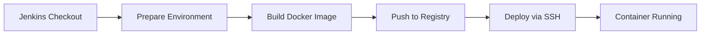

# 🚀 Day 14 — Build a Maven Project - Complete Guide

## 📋 Overview

This guide demonstrates a complete **Jenkins CI/CD pipeline** for building, containerizing, and deploying a **Maven-based Java application** using Docker multi-platform builds. The pipeline automates the entire workflow from code checkout to production deployment.

## 🎯 Key Features

- ✅ **Automated Maven Build**: Builds Java applications using Maven
- ✅ **Multi-Platform Docker Images**: Supports ARM64 and AMD64 architectures
- ✅ **Self-Signed Certificate Support**: Works with private Docker registries
- ✅ **SSH Deployment**: Automated deployment to remote servers
- ✅ **Build Metadata**: Embedded build information in containers
- ✅ **Email Notifications**: Success/failure alerts
- ✅ **Retry Mechanism**: Automatic retry on failures


## 🎬 Video Demonstration

[](https://youtu.be/QrOvhrBoXJk)

## 🏗️ Architecture



## 📦 What You'll Build

A production-ready CI/CD pipeline that:
1. Checks out Maven project from Git
2. Prepares build environment with metadata
3. Builds multi-platform Docker images
4. Pushes images to private registry
5. Deploys containerized application via SSH
6. Sends email notifications

## 🔗 Demo Repository

**Git Repository**: [simple-maven-app](https://github.com/meibraransari/simple-maven-app)  
**Branch**: `main`

## ⚙️ Jenkins Pipeline Configuration

### 📋 Prerequisites

Before setting up the pipeline, ensure you have:

1. **Jenkins Installation** with required plugins:
   - Pipeline plugin
   - Git plugin
   - SSH Agent plugin
   - Email Extension plugin
   - Credentials plugin

2. **Jenkins Agents** configured:
   - Agent labeled `sg` (for build tasks)
   - Agent labeled `mgmt` (for deployment)

3. **Docker Environment**:
   - Docker with Buildx support installed on build agent
   - QEMU for multi-architecture builds
   - Access to Docker registry (`hub.devopsinaction.lab`)

4. **Credentials** configured in Jenkins:
   - Docker registry credentials (ID: `d482446e-e815-4122-bf2d-a68ad17567b7`)
   - SSH credentials for remote server (ID: `210-ssh-remote-server-mumbai-region`)

5. **Production Server**:
   - SSH access to production server (192.168.1.210)
   - Docker installed on production server

---

### Step 1: Create a New Pipeline Job

1. Navigate to Jenkins Dashboard
2. Click **"New Item"**
3. Enter a name for your pipeline like: Day-14_Jenkins_Build_Maven_Project
4. Select **"Pipeline"**
5. Click **"OK"**

---

### Step 2: Configure Job Description

In the General section of the Pipeline configuration, add the following description to document your pipeline:

**Description**
```
<b>Demo Environment</b> <br>
<b>Git: </b> https://github.com/meibraransari/simple-maven-app.git <br>
<b>Branch: </b> master <br>
<b>Domain: </b> NA <br>
```

### Step 3: Add Pipeline Script

In the Pipeline configuration section, select **"Pipeline script"** and paste the following:

```groovy
pipeline {
    // agent { label 'sg' }  // Use a specific agent labeled 'sg'
    // agent any  // Uncomment this to use any available agent
    agent none

    environment {
        DEPLOY_ENV = "staging"
        APP_NAME = "simple-node-js-react-npm-app" 
        GIT_URL = "https://github.com/meibraransari/simple-maven-app.git"
        GIT_BRANCH = "main"
        // Docker details
        DOCKER_HOST_CREDENTIALS = credentials('d482446e-e815-4122-bf2d-a68ad17567b7')
        MY_DOCKER_HOST = 'hub.devopsinaction.lab'
        DATE = new Date().format('d.M.YY')
        DOCKER_IMAGE = 'hub.devopsinaction.lab/java-demo'
        DOCKER_IMAGE_TAG = "${DATE}.${BUILD_NUMBER}"
        DOCKER_LATEST_TAG ="latest"
        PLATFORMS="linux/arm64,linux/amd64"
        // Container details
        container_name = 'c-java-demo'
        container_EXT_port = '8080'
        container_INT_port = '8080'
        // Prod server details
        PROD_SERVER_IP = '192.168.1.210'
        PROD_SERVER_USER = 'user'
        ENV_PATH = '/opt/project'
        ENV_NAME = 'project_admin_env'
        
    }
    // Global options
    options {
        timeout(time: 30, unit: 'MINUTES') // Set timeout to 30 minutes
        timestamps() // Add timestamps to console log
        //retry(2)   // Retries the whole pipeline if any stage fails.
        disableConcurrentBuilds() // Disable concurrent builds
    }

    stages {
        stage('Checkout') {
            when { expression { true } }
            agent { label 'sg' }
            options {
                retry(3)   // Retry this stage up to 3 times(Enable it if global Retry is off)
            }
            steps {
                echo "🧾 Checking out code..."
                git url: GIT_URL, branch: GIT_BRANCH
                script {
                    currentBuild.description = "Env=${DEPLOY_ENV}, Branch=${GIT_BRANCH}"
                }
            }
        }
        stage ('Prepare Environment') {
            when { expression { true } }
            agent { label 'sg' }
            steps {
                    echo 'Building the application ${env.JOB_NAME}...'
                    sh 'rm -rf ${workspace}'
                    //sh 'echo "$PACKAGE_JSON" | tee > package.json'
                    //sh 'echo "$Dockerfile" | tee > Dockerfile'
                    sh 'rm -rf build_info'
                    sh 'TZ="Asia/Kolkata" date "+Build Time: %d-%m-%Y %H:%M:%S %Z" | tee -a build_info'
                    sh 'echo "Jenkins Build Number: ${BUILD_NUMBER}" | tee >> build_info'
                    sh 'echo "Git Branch: ${GIT_BRANCH}" | tee >> build_info'
                    
            }
        }
		stage('Build & push Docker Image') {
		    when { expression { true } }
		    agent { label 'sg' }
		    steps {
		        sh '''
		        # Login to private registry
		        echo $DOCKER_HOST_CREDENTIALS_PSW | docker login \
		          -u $DOCKER_HOST_CREDENTIALS_USR \
		          --password-stdin ${MY_DOCKER_HOST}

		        # Enable multi-arch support
		        docker run --rm --privileged multiarch/qemu-user-static --reset -p yes

		        # Remove existing builder if present
		        docker buildx rm multiarch-builder || true

                # Create buildx configuration for insecure registry
                cat > /tmp/buildkitd.toml <<EOF
[registry."${MY_DOCKER_HOST}"]
  http = false
  insecure = true
EOF

		        # Create buildx builder for selfsigned sertificate
		        docker buildx create \
		          --name multiarch-builder \
		          --use \
		          --driver docker-container \
		          --driver-opt image=moby/buildkit:buildx-stable-1 \
		          --driver-opt network=host \
		          --config /tmp/buildkitd.toml \
		          --buildkitd-flags '--allow-insecure-entitlement security.insecure'
		          
		        # Create buildx builder for production
                #docker buildx create --name multiarch-builder --use || docker buildx use multiarch-builder

		        # Bootstrap builder
		        docker buildx inspect --bootstrap

		        # Build and push multi-platform image
		        docker buildx build \
		          --platform=${PLATFORMS} \
		          --no-cache \
		          --push \
		          -t $DOCKER_IMAGE:$DOCKER_LATEST_TAG \
		          -t $DOCKER_IMAGE:$DOCKER_IMAGE_TAG .
		        '''
		    }
		}
        stage ('Deploy_Over_SSH') {  
            when { expression { true } }
            //when { expression { currentBuild.result == 'SUCCESS' } } // Execute only if the 'test' stage is successful
            agent { label 'mgmt' } 
            steps {
                script {
                    sshagent(['210-ssh-remote-server-mumbai-region']) {
                    echo 'Deploying the application....'
                    sh """
                    ssh -o StrictHostKeyChecking=no $PROD_SERVER_USER@$PROD_SERVER_IP << 'EOF'
                    docker ps -a
                    echo $DOCKER_HOST_CREDENTIALS_PSW | docker login -u $DOCKER_HOST_CREDENTIALS_USR --password-stdin ${MY_DOCKER_HOST}
                    sudo docker pull $DOCKER_IMAGE:$DOCKER_LATEST_TAG
                    sudo docker rm $container_name -f > /dev/null 2>&1
                    sleep 2
                    #docker run -d --restart=always  --name $container_name -v $ENV_PATH/$ENV_NAME:/usr/share/nginx/www/.env -p $container_EXT_port:$container_INT_port $DOCKER_IMAGE:$DOCKER_LATEST_TAG
                    docker run -d --restart=always  --name $container_name -p $container_EXT_port:$container_INT_port $DOCKER_IMAGE:$DOCKER_LATEST_TAG
                    exit
                    EOF
                    """
                    }
                }
            }  
        }
    }
    post {
        success {
            echo "🎉 Pipeline completed successfully!"
            script {
                try {
                    emailext(
                        subject: "Build Success: ${env.JOB_NAME}",
                        body: "Check console output at ${env.BUILD_URL}",
                        to: "jenkins@devopsinaction.lab"
                    )
                } catch (e) {
                    echo "Email not configured, skipping success notification"
                }
            }
        }

        failure {
            echo "❌ Pipeline failed."
            script {
                try {
                    emailext(
                        subject: "Build Failed: ${env.JOB_NAME}",
                        body: "Check console output at ${env.BUILD_URL}",
                        to: "jenkins@devopsinaction.lab"
                    )
                } catch (e) {
                    echo "Email not configured, skipping failure notification"
                }
            }
        }

        // always {
        //     echo "🧹 Cleaning workspace..."
        //     cleanWs()
        // }
    }
}
```

---

### Step 4: Save and Build

1. Click **"Save"**
2. Click **"Build Now"**
3. Monitor the pipeline execution in the **"Stage View"**


**🎉 Success!** Finally, we completed.

---

## 📊 Pipeline Stages Explained

### 1️⃣ Checkout Stage
- **Purpose**: Clone the Maven project from Git repository
- **Agent**: Runs on `sg` labeled agent
- **Retry**: Up to 3 attempts on failure
- **Output**: Sets build description with environment and branch info

### 2️⃣ Prepare Environment Stage
- **Purpose**: Create build metadata and prepare workspace
- **Actions**:
  - Creates `build_info` file with timestamp, build number, and branch
  - Cleans workspace for fresh build
- **Timezone**: Asia/Kolkata

### 3️⃣ Build & Push Docker Image Stage
- **Purpose**: Build multi-platform Docker image and push to registry
- **Key Steps**:
  1. Login to private Docker registry
  2. Enable multi-architecture support via QEMU
  3. Configure Buildx for self-signed certificates
  4. Build for ARM64 and AMD64 platforms
  5. Push with version tag and latest tag
- **Platforms**: `linux/arm64`, `linux/amd64`

### 4️⃣ Deploy Over SSH Stage
- **Purpose**: Deploy container to production server
- **Agent**: Runs on `mgmt` labeled agent
- **Actions**:
  1. SSH into production server
  2. Pull latest Docker image
  3. Remove old container
  4. Start new container with restart policy
- **Port Mapping**: 8080:8080

### 5️⃣ Post Actions
- **Success**: Sends success email notification
- **Failure**: Sends failure email notification
- **Cleanup**: Workspace cleanup (commented out)

---

## ✅ Verification

### 🐳 Verify Multi-Platform Docker Image

Check the Docker registry to confirm both ARM64 and AMD64 architectures are available:

```
https://hubdash.devopsinaction.lab/repo/java-demo
```

You should see multiple architecture manifests in the image details.

### 🌐 Verify Deployment

Access the deployed application using the production server IP and port:

```bash
http://192.168.1.210:8080/
```

### 🔍 Check Container Status

Verify the container is running on the production server:

```bash
# SSH into production server
ssh user@192.168.1.210

# Check running containers
docker ps | grep c-java-demo

# View container logs
docker logs c-java-demo
```

---
## 🧠 About This Project

**Made with ❤️ for DevOps Engineers** 

Powered by **DevOps In Action**, this repository offers **real-world, hands-on DevOps setups** for CI/CD pipelines, containerization, Kubernetes, cloud platforms (AWS, GCP, Azure), and infrastructure at scale.

## 📝 License

This guide is provided as-is for educational and professional use.

## 🤝 Contributing

Feel free to suggest improvements or report issues.


### 💼 Connect with Me 👇😊

*   🔥 [**YouTube**](https://www.youtube.com/@DevOpsinAction?sub_confirmation=1)
*   ✍️ [**Blog**](https://ibraransari.blogspot.com/)
*   💼 [**LinkedIn**](https://www.linkedin.com/in/ansariibrar/)
*   👨‍💻 [**GitHub**](https://github.com/meibraransari?tab=repositories)
*   💬 [**Telegram**](https://t.me/DevOpsinActionTelegram)
*   🐳 [**Docker Hub**](https://hub.docker.com/u/ibraransaridocker)

### ⭐ If You Found This Helpful...

***Please star the repo and share it! Thanks a lot!*** 🌟


