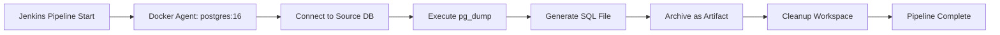

# 🚀 Day 15 — Export PostgreSQL Database and Use it as Artifact

## 📋 Overview

This Jenkins pipeline automates the process of **exporting a PostgreSQL database** and **archiving it as a Jenkins artifact**. This is particularly useful for:

- 🔄 Creating database backups for team distribution
- 📦 Sharing database snapshots across environments
- 🧪 Setting up test databases with production-like data
- 💾 Maintaining versioned database exports

---

## 🏗️ Pipeline Architecture



## 🎬 Video Demonstration

[](https://youtu.be/nCQCEGV7BrU)


---

## 📦 Prerequisites

### 🔧 Required Jenkins Plugins

Navigate to: **Jenkins → Manage Jenkins → Manage Plugins**

Install the following plugin:

| Plugin | Purpose |
|--------|---------|
| ✅ **Docker Pipeline** | Enables Docker agent functionality in Jenkins pipelines |

> **Note:** After installing, restart Jenkins for the plugin to take effect.

### 🖥️ Jenkins Agent Requirements

- **Agent Label:** `sg` (or modify to match your agent label)
- **Docker:** Must be installed and accessible on the Jenkins agent
- **Network Access:** Agent must be able to reach the PostgreSQL database server

### 🗄️ PostgreSQL Database Access

Ensure you have:
- ✅ Database host and port
- ✅ Database name
- ✅ Valid user credentials with dump privileges
- ✅ Network connectivity from Jenkins agent to the database

---

## 🔐 Pipeline Configuration

### Environment Variables

The pipeline uses the following environment variables to connect to the source database:

```groovy
environment {
    SOURCE_DB_HOST = '192.168.1.210'      // PostgreSQL server IP/hostname
    SOURCE_DB_PORT = '5432'               // PostgreSQL port (default: 5432)
    SOURCE_DB_NAME = 'mydatabase'         // Database name to export
    SOURCE_DB_USER = 'myuser'             // Database user
    SOURCE_DB_PASSWORD = 'mypassword'     // Database password
}
```

> ⚠️ **Security Best Practice:** Instead of hardcoding credentials, use Jenkins Credentials and reference them securely:
> ```groovy
> environment {
>     SOURCE_DB_PASSWORD = credentials('postgres-password-id')
> }
> ```

---

## 📜 Complete Jenkinsfile

```groovy
pipeline {
    agent none
    environment {
        SOURCE_DB_HOST = '192.168.1.210'
        SOURCE_DB_PORT = '5432'
        SOURCE_DB_NAME = 'mydatabase'
        SOURCE_DB_USER = 'myuser'
        SOURCE_DB_PASSWORD = 'mypassword'
    }
    stages {
        stage('Dump Source Database') {
            agent {
                docker {
                    image 'postgres:16'
                    args '-u root:root'
                    reuseNode true
                }
            }
            steps {
                script {
                    withEnv(["PGPASSWORD=${SOURCE_DB_PASSWORD}"]) {
                        sh '''
                        pg_dump \
                          -h ${SOURCE_DB_HOST} \
                          -p ${SOURCE_DB_PORT} \
                          -U ${SOURCE_DB_USER} \
                          -d ${SOURCE_DB_NAME} \
                          > DEMO_DB_Backup_For_Team.sql
                        '''
                    }
                }
            }
        }

        stage('Archive Artifacts') {
            agent { label 'sg' } 
            steps {
                archiveArtifacts artifacts: 'DEMO_DB_Backup_For_Team.sql', allowEmptyArchive: false
            }
        }
    }

    post {
        cleanup {
            node('sg') {
                deleteDir()
            }
        }
    }
}
```

---

## 🔍 Pipeline Stages Explained

### 1️⃣ **Dump Source Database**

**Purpose:** Export the PostgreSQL database to a SQL file

**How it works:**
- 🐳 Spins up a temporary Docker container using the `postgres:16` image
- 🔑 Sets the `PGPASSWORD` environment variable for authentication
- 📤 Runs `pg_dump` command to export the database
- 💾 Saves the output to `DEMO_DB_Backup_For_Team.sql`

**Key Parameters:**
- `-h`: Database host
- `-p`: Database port
- `-U`: Database user
- `-d`: Database name
- `>`: Redirects output to SQL file

### 2️⃣ **Archive Artifacts**

**Purpose:** Store the exported SQL file as a Jenkins artifact

**How it works:**
- 📦 Uses Jenkins' `archiveArtifacts` step
- 💾 Stores `DEMO_DB_Backup_For_Team.sql` in Jenkins build artifacts
- ✅ Fails the build if the file is empty or missing (`allowEmptyArchive: false`)

**Benefits:**
- Files are accessible from the Jenkins UI
- Can be downloaded by team members
- Retained according to Jenkins artifact retention policy
- Version controlled per build number

### 3️⃣ **Post-Build Cleanup**

**Purpose:** Clean up workspace to save disk space

**How it works:**
- � Runs after pipeline completion (success or failure)
- 🗑️ Deletes all files in the workspace directory
- 💽 Prevents disk space accumulation over multiple builds

---

## 🎯 How to Use

### Step 1: Create a New Pipeline Job

1. Navigate to **Jenkins Dashboard**
2. Click **New Item**
3. Enter a job name (e.g., `PostgreSQL-DB-Export`)
4. Select **Pipeline** and click **OK**

### Step 2: Configure the Pipeline

1. Scroll to the **Pipeline** section
2. Select **Pipeline script** from the Definition dropdown
3. Copy and paste the Jenkinsfile code above
4. **Update the environment variables** with your database details

### Step 3: Run the Pipeline

1. Click **Build Now**
2. Monitor the build progress in the console output
3. Once complete, find the SQL file in **Build Artifacts**

### Step 4: Download the Artifact

1. Navigate to the build page
2. Click on **Build Artifacts**
3. Download `DEMO_DB_Backup_For_Team.sql`

---

## 🛠️ Customization Options

### Change Output Filename

Modify the output filename in the `pg_dump` command:

```bash
pg_dump ... > MyCustomBackup_$(date +%Y%m%d).sql
```

### Add Compression

Compress the output to save space:

```bash
pg_dump ... | gzip > DEMO_DB_Backup_For_Team.sql.gz
```

Then update the artifact pattern:
```groovy
archiveArtifacts artifacts: 'DEMO_DB_Backup_For_Team.sql.gz', allowEmptyArchive: false
```

### Use Different PostgreSQL Version

Change the Docker image version:

```groovy
agent {
    docker {
        image 'postgres:15'  // or postgres:14, postgres:13, etc.
        args '-u root:root'
        reuseNode true
    }
}
```

### Add Data-Only or Schema-Only Exports

Modify the `pg_dump` command:

```bash
# Schema only
pg_dump --schema-only ...

# Data only
pg_dump --data-only ...
```

---

## 🐛 Troubleshooting

### Issue: "Could not connect to database"

**Possible Causes:**
- ❌ Incorrect host/port
- ❌ Firewall blocking connection
- ❌ Database server is down

**Solutions:**
- ✅ Verify database connectivity: `telnet <host> <port>`
- ✅ Check firewall rules
- ✅ Ensure PostgreSQL service is running

### Issue: "Permission denied"

**Possible Causes:**
- ❌ User lacks dump privileges
- ❌ Incorrect password

**Solutions:**
- ✅ Grant necessary privileges: `GRANT SELECT ON ALL TABLES IN SCHEMA public TO myuser;`
- ✅ Verify credentials

### Issue: "Docker daemon not available"

**Possible Causes:**
- ❌ Docker not installed on agent
- ❌ Jenkins user lacks Docker permissions

**Solutions:**
- ✅ Install Docker on the Jenkins agent
- ✅ Add Jenkins user to docker group: `sudo usermod -aG docker jenkins`

### Issue: "No such file or directory"

**Possible Causes:**
- ❌ `pg_dump` failed silently
- ❌ File path issue

**Solutions:**
- ✅ Check console output for errors
- ✅ Add error handling: `set -e` in shell script

---

## 🔒 Security Best Practices

1. **Never hardcode passwords** — Use Jenkins Credentials Store
2. **Limit database user privileges** — Grant only necessary permissions
3. **Secure artifact access** — Configure Jenkins security to restrict artifact downloads
4. **Use SSL/TLS** — Enable encrypted database connections when possible
5. **Rotate credentials regularly** — Update database passwords periodically

---

## 📚 Additional Resources

- [PostgreSQL pg_dump Documentation](https://www.postgresql.org/docs/current/app-pgdump.html)
- [Jenkins Pipeline Syntax](https://www.jenkins.io/doc/book/pipeline/syntax/)
- [Docker Pipeline Plugin](https://plugins.jenkins.io/docker-workflow/)

---

## �🧠 About This Project

**Made with ❤️ for DevOps Engineers** 

Powered by **DevOps In Action**, this repository offers **real-world, hands-on DevOps setups** for CI/CD pipelines, containerization, Kubernetes, cloud platforms (AWS, GCP, Azure), and infrastructure at scale.

---

## 📝 License

This guide is provided as-is for educational and professional use.

---

## 🤝 Contributing

Feel free to suggest improvements or report issues via pull requests or the issues tab.

---

## 💼 Connect with Me 👇😊

*   🔥 [**YouTube**](https://www.youtube.com/@DevOpsinAction?sub_confirmation=1)
*   ✍️ [**Blog**](https://ibraransari.blogspot.com/)
*   💼 [**LinkedIn**](https://www.linkedin.com/in/ansariibrar/)
*   👨‍💻 [**GitHub**](https://github.com/meibraransari?tab=repositories)
*   💬 [**Telegram**](https://t.me/DevOpsinActionTelegram)
*   🐳 [**Docker Hub**](https://hub.docker.com/u/ibraransaridocker)

---

### ⭐ If You Found This Helpful...

***Please star the repo and share it! Thanks a lot!*** 🌟
