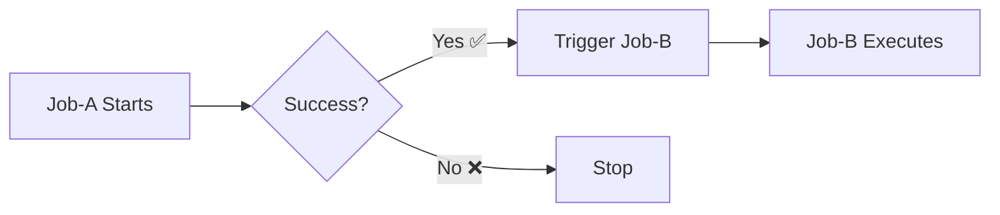

# 🚀 Day 17 — Start Job B from Job A on Success

## 📖 Overview

Chain Jenkins jobs together! Job A triggers Job B automatically upon successful completion.

---

## ✅ Prerequisites

- Jenkins installed and running
- Basic knowledge of Jenkins Pipeline syntax
- Access to create and configure Jenkins jobs

---

## 🎬 Video Demonstration

[](https://youtu.be/WRR69Ghcv5g)


## 🔧 Job Configurations

### 📦 Job-A (Upstream Job)

**Purpose:** Main job that triggers Job-B on success

```groovy
pipeline {
    agent any

    stages {
        stage('Job A Execution') {
            steps {
                echo 'Job A is running'
            }
        }
    }

    post {
        success {
            echo 'Job A succeeded. Triggering Job B...'
            //build job: 'Job-B'
            build(job: 'Job-B', wait: false)
        }
    }
}
```

**Key Points:**
- ✅ `post` block executes after all stages
- ✅ `success` condition runs only if job succeeds
- ✅ `build(job: 'Job-B', wait: false)` triggers Job-B asynchronously

---

### 📦 Job-B (Downstream Job)

**Purpose:** Job triggered automatically by Job-A

```groovy
pipeline {
    agent any

    stages {
        stage('Job B Execution') {
            steps {
                echo 'Job B started because Job A succeeded'
            }
        }
    }
}
```

---

## 🚀 Setup Steps

1. **Create Job-A** 🛠️
   - New Item → Pipeline
   - Name: `Job-A`
   - Paste Job-A pipeline script

2. **Create Job-B** 🛠️
   - New Item → Pipeline
   - Name: `Job-B`
   - Paste Job-B pipeline script

3. **Run Job-A** ▶️
   - Click "Build Now" on Job-A
   - Job-B will auto-trigger on success

---

## 🎯 How It Works



---

## 🔍 Verification

✅ Check Job-A console output for trigger message  
✅ Verify Job-B starts automatically  
✅ Review Build History for both jobs  

---

## 🎁 Optional Enhancements

**Synchronous Trigger:**
```groovy
build(job: 'Job-B', wait: true)  // Wait for Job-B to complete
```

**Pass Parameters:**
```groovy
build(job: 'Job-B', 
      parameters: [string(name: 'PARAM', value: 'value')],
      wait: false)
```

---

## 📝 License

This guide is provided as-is for educational and professional use.

---

## 🤝 Contributing

Feel free to suggest improvements or report issues via pull requests or the issues tab.

---

## 💼 Connect with Me 👇😊

*   🔥 [**YouTube**](https://www.youtube.com/@DevOpsinAction?sub_confirmation=1)
*   ✍️ [**Blog**](https://ibraransari.blogspot.com/)
*   💼 [**LinkedIn**](https://www.linkedin.com/in/ansariibrar/)
*   👨‍💻 [**GitHub**](https://github.com/meibraransari?tab=repositories)
*   💬 [**Telegram**](https://t.me/DevOpsinActionTelegram)
*   🐳 [**Docker Hub**](https://hub.docker.com/u/ibraransaridocker)

---

### ⭐ If You Found This Helpful...

***Please star the repo and share it! Thanks a lot!*** 🌟
